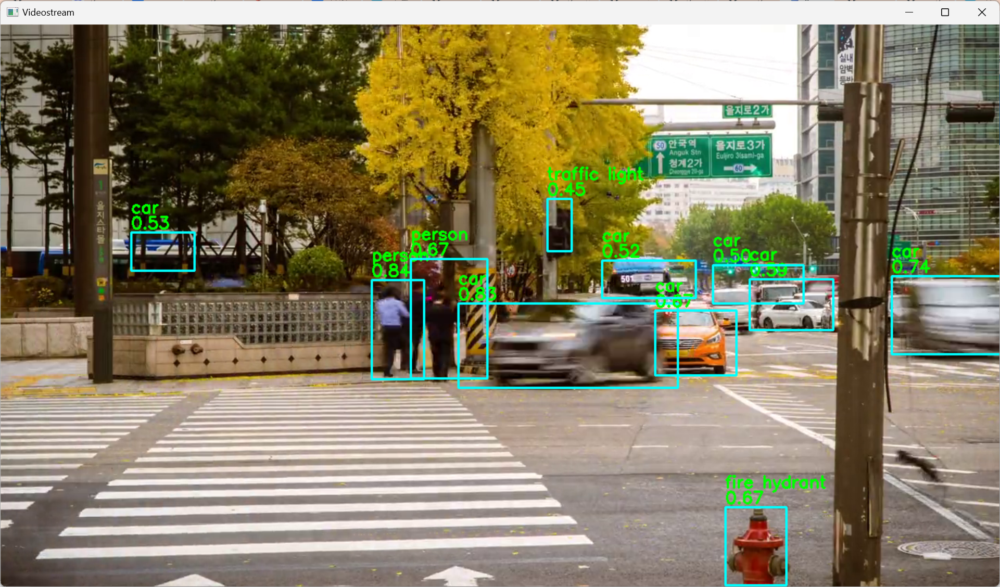

# FastestStreamDet最速流推理

***A inference implementation that supports multiple input streams in a single file based on FastestDet.***

***一个基于FastestDet的单文件多类型输入推理实现***

~~开箱即用兄dei~~




# Advance强处

* Use the ONNX model to infer real-time camera streams, images, and video file streams.
* 使用通用开源的onnx模型格式，能推理摄像头实时流、图片、视频文件流等多种类型的输入。
* Simply output inference results in a variety of ways.
* 输出可随心所欲地以不同方式（保存、字节码导出返回……）处理，~~文件里都给你提前写好想要什么输出方式了~~
* Single file.
* 单文件。（指的是命令行用的核心部分，UI实现看看行不行吧）
* Debugged problem carefully, fixing most bugs.
* 踩了无数的坑,包没问题的,有错你~~踹~~Issue我


# How to use咋用
**Tips: Never use ctrl+c to force an working program stopping. You may found the camera still being used.**

**别手贱直接CTRL+C给正常工作的推理进程干掉了，不然用摄像头的时候有你好果子吃的（摄像头：这给我干哪了，这还是地球吗？）**

## Install the required dependencies firstly
## 先把下面这些库装好,python不是3.8版本的话会有奇妙的bug
**The dependency onnxruntime might be hard to installed on Linux platforms.**

**Linux装onnxruntime是真的坐牢，慎用**
* Python(3.8 for recommended version) and pip
* opencv-python
* numpy==1.23.0
* onnx_simplifier==0.3.10
* onnxruntime==1.16.0
* pathlib
* argparse

## Demo示例
* Type in the terminal:
* 复制到终端回车：

  ```
  python detect.py --source datatest/6.jpg
  ```

* Check your result image in the resultsave folder.
* 看看 resultsave 文件夹里保存的推理结果

* Type in the terminal:
* 复制到终端回车：
  
  ```
  python detect.py --source video --videofile datatest/21115-315137069_small.mp4
  python detect.py --source video --videofile datatest/2174-155747455_small.mp4
  ```

* The First example video owned by [Jahhoo](https://pixabay.com/users/jahhoo-1418773/)
* The Second example video owned by [RafterJr72](https://pixabay.com/users/rafterjr72-11468402/)
* 以上示例视频由这两位作者分别所拥有

* Check the detect result through the new window created by opencv
* 通过opencv打开的视频流窗口查看推理结果

* Click "q" to end the detect process.
* 按“q”键终止推理进程
  

## CameraStream摄像头实时流
* Choose your own camera index then type in terminal:
* 选好摄像头的编号复制到终端回车：
  
  ```
  python detect.py
  ```
* or use your own camera index:
* 不然就在下面的命令后边打上摄像头在系统中的序号，Windows是设备管理器，Linux可以用v4l2-ctl：
  
  ```
  python detect.py --source {your camera index, it usual in integer type}
  ```

* Check the detect result through the new window created by opencv
* 通过opencv打开的视频流窗口查看推理结果

* Click "q" to end the detect process.
* 按“q”键终止推理进程


## Picture图片
* Type in the terminal:
* 复制到终端回车：
  
  ```
  python detect.py --source {your Picturefilepath}
  ```

* Check your result image in the resultsave folder.
* 看看 resultsave 文件夹里保存的推理结果


## VideoStream视频文件流
* Type in the terminal:
* 复制到终端回车：
  
  ```
  python detect.py --source video --videofile {your videofilepath}
  ```

* Check the detect result through the new window created by opencv
* 通过opencv打开的视频流窗口查看推理结果

* Click "q" to end the detect process.
* 按“q”键终止推理进程

# Todo待完成

* Save the VideoStream detection result as a file
* 以文件形式保存视频流推理结果
* Write an UI to adapt most usage
* 写一个能适用于大多数场景需求的UI
* Multi CPU core Inferences
* 多核推理
* Use ncnn Framework(almost done)
* 使用ncnn来编译推理(接近完成,孩子原先的ncnn已经编译成功啦)

# Reference引用

* [FastestDet](https://github.com/dog-qiuqiu/FastestDet)
* [onnx](https://github.com/onnx/onnx)
* [Jahhoo](https://pixabay.com/users/jahhoo-1418773/)
* [RafterJr72](https://pixabay.com/users/rafterjr72-11468402/)
